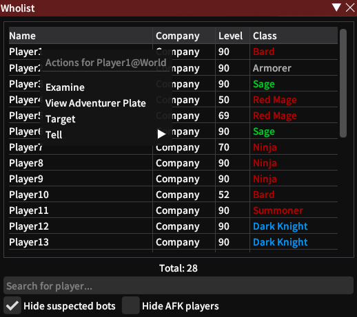

  
### Wholist

Show nearby players, alike to World of Warcraft's "/who" command 

**[Issues](https://github.com/BitsOfAByte/Wholist/issues) · [Pull Requests](https://github.com/BitsOfAByte/Wholist/pulls) · [Releases](https://github.com/BitsOfAByte/Wholist/releases/latest)**

---

## About

Wholist re-implements the `/who` command from World of Warcraft and provides a very simple way to filter and find people that are nearby to you. It also provides an easy way to examine or target players from a context menu.

## Features

- Easy to read interface
- Full localization support
- Basic "bot filtering" capabilities
- Built in context menu for examining, targeting, viewing adventurer plates & sending tells
- Customizable colours via Dalamud's built in style editor

## Screenshots
