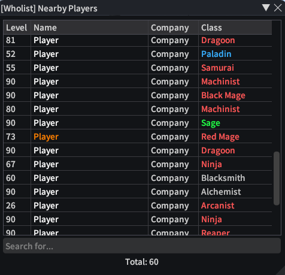
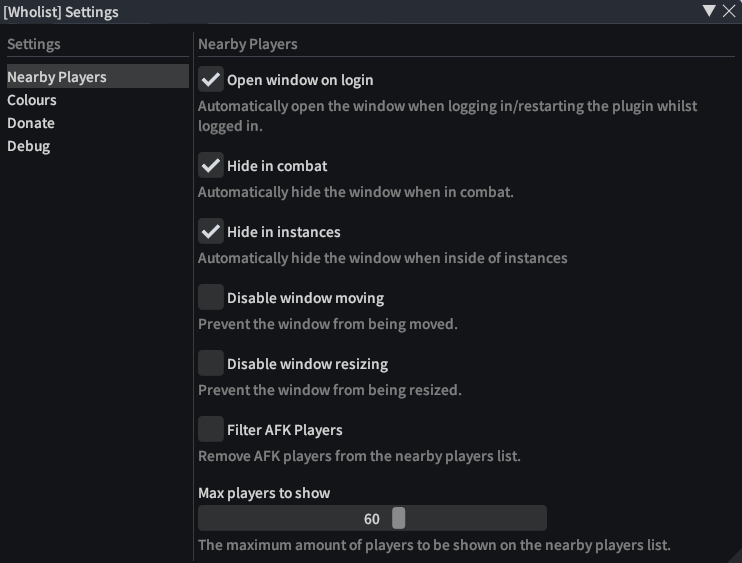

  
### Wholist

Show who's nearby you, inspired by the `/who` command from World of Warcraft 

**[Issues](https://github.com/BitsOfAByte/Wholist/issues) · [Pull Requests](https://github.com/BitsOfAByte/Wholist/pulls) · [Releases](https://github.com/BitsOfAByte/Wholist/releases/latest)**

---

## About

Wholist implements a nearby player list, inspired by the `/who` command from World of Warcraft. It provides a very simple way to search for players nearby and do common actions such as examining, viewing adventure plates, finding them on the map and more.

## Features

- Minimalistic UI with a search bar that can be scaled down to become a part of your everyday UI.
- Full localization support, using both game language and Dalamud's language settings where applicable.
- Automatic removal of "bot-like" players from the list.
- Built in context-menu for examining, targeting, viewing adventurer plates and more.
- Highlighting of your friends and party members in the list.
- Fully customizable colours for both job role colours and highlight colours.
- The ability to hide rows on the list that you don't want to see by right-clicking the header row.
- Integrates with other plugins via IPC ([learn more](https://github.com/BitsOfAByte/Wholist/blob/main/Wholist/IPC.md))

## Installation

You can install Wholist by using the Dalamud Plugin Installer. You should not manually download the plugin from repository artifacts or other 3rd-party repositories as they may be outdated or contain malicious code. If you are unsure about how to install plugins, please review Dalamud's FaQ.

## Configuration

Wholist has a built in settings window that can be accessed by clicking the cog icon next in the plugin installer or by typing `/whosettings` in-game.

## Restrictions

Due to the nature of how Wholist gathers information about nearby players, you will only be able to see players that the server has sent information about. This means that the range of players you can see is limited by whatever the server has decided to send you, as well as how many players are nearby you already.

It will also automatically hide the UI if you are partaking in Player vs Player content to prevent any competitive advantages that could come from using this plugin. This cannot be disabled.

## Screenshots

Nearby Players Window

Settings Window

## License & Contributing

Wholist is licensed under the [AGPL-3.0 License](https://github.com/BitsOfAByte/Wholist/blob/main/LICENSE). Contributions are welcome as long as they follow Dalamud's rules for plugin creation and remain in-scope. Please try to use the [Commit Convention](https://github.com/BitsOfAByte/Wholist/blob/main/COMMIT_CONVENTION.md) when making commits to the repository.

If you want to help translate Wholist into your language, please visit the [Crowdin project](https://crwd.in/wholist) and submit your translations there. If the language you want to translate to is not available, please create an issue and it will be added.
